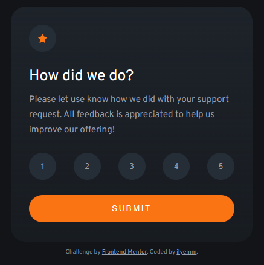
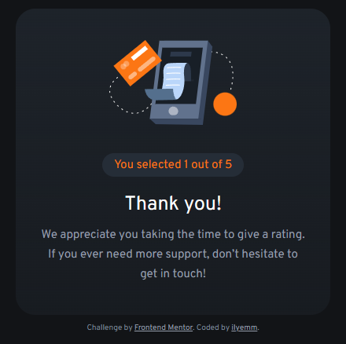

# Frontend Mentor - Interactive rating component solution

This is a solution to the [Interactive rating component challenge on Frontend Mentor](https://www.frontendmentor.io/challenges/interactive-rating-component-koxpeBUmI). Frontend Mentor challenges help you improve your coding skills by building realistic projects. 

## Table of contents

- [Overview](#overview)
  - [The challenge](#the-challenge)
  - [Screenshot](#screenshot)
  - [Links](#links)
- [My process](#my-process)
  - [Built with](#built-with)
  - [What I learned](#what-i-learned)
  - [Continued development](#continued-development)
  - [Useful resources](#useful-resources)
- [Author](#author)
- [Acknowledgments](#acknowledgments)

## Overview

### The challenge

Users should be able to:

- View the optimal layout for the app depending on their device's screen size
- See hover states for all interactive elements on the page
- Select and submit a number rating
- See the "Thank you" card state after submitting a rating

### Screenshot





### Links

- Solution URL: [Frontend Mentor](https://www.frontendmentor.io/solutions/using-vanilla-htmlcssjavascript-to-create-active-states-berDkv0nLp)
- Live Site URL: [Github Pages](https://ilyemm.github.io/interactive-rating/)

## My process

I've been using the same approach of building the outer container before diving up the smaller components of the design. The main thing I want to point out in the HTML/CSS front at least is how amazing flexbox is! I had used the display: table previously, and there was still some issues. The second I had switched to flexbox and had read up on resources, it was just so much easier to position things. 

Another thing I want to point out is using display: none and display: block to toggle between the landing page and the submission page! I couldn't figure out how I was supposed to maintain the container size for both the landing and submission states, but I was able to use that as a way to move to another state.

After figuring out the HTML/CSS, I moved onto the JavaScript which was admittedly a lot harder as a lot of my programming knowledge is in Python for scripting and data science purposes. After browsing through some documentation and tutoritals though, I was able to configure an active state that lasted after the button press for the rating buttons and submissions to transfer the active button value to the submission page. Additionally, I added an alert to make sure the user selects some rating before being able to have a successful submission! 

This was fun to learn! I'm excited for more JavaScript in my Full-Stack adventure! 

### Built with

- Semantic HTML5 markup
- CSS custom properties
- Flexbox
- JavaScript (jQuery specifically)

### What I learned

Main thing I want to highlight is the JavaSript I coded into the page.
Here's the snippet:

```js
$(document).ready(function()
    {
      $(".rating-scale button").click(function() {
        $(".rating-scale button").removeClass('selected-button');
        $(this).addClass('selected-button');
      });

      $(".submit-button").click(function() {
        output = $(".rating-scale").find('.selected-button').val();
        if (output === undefined)
        {
          alert("Please submit a value before you submit!");
          return false;
        }
        $(".selected-value").text(output);

        $(".landing-page").css("display", "none");
        $(".submitted-page").css("display", "block");
      });
    });
```

I'm also proud that I finally have the design centered in the middle of the website regardless of the window size! Big win!

### Continued development

I couldn't figure out how to toggle the active state of the rating button after initially selecting it, so that's something I want to improve on afterwards. 

### Useful resources

- [jQuery Examples from W3](https://www.w3schools.com/jquery/jquery_examples.asp) - This helped me see how jQuery was typically used! A great reference for a quick learn. 

## Author

- Frontend Mentor - [@ilyemm](https://www.frontendmentor.io/profile/ilyemm)

## Acknowledgments

Big ups to [Abdul Khalid](https://www.frontendmentor.io/profile/0xAbdulKhalid) for the tip about using flexbox to center the design on the website! He was the one that mentioned using the min-height: 100vh and flexbox combination to be able to center it properly. 
